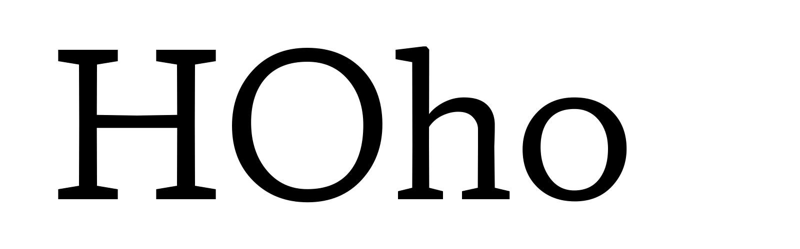

## Proposed Axis Details

**Tag:** yopq

**Name:** Y Opaque

**Axis type:** Parametric

**Description:** assigns a “black” per mille value to each instance of the design space

**Valid numeric range:**  -1000 to 2000

**Scale interpretation:** Values should be interpreted as per-mille-of-em

**Recommended or required “Regular” value:** N/A

**Suggested programmatic interactions:** Example: Combined with `xopq`, a program or script can adjust each parameter to improve legibility at small sizes.

**UI recommendations:** Users may choose to program a variant in connection to direct or conjunctive input for a page description language, or via a user interface

**Script or language considerations:** Can be used for all scripts

**Related axes:** wght, width, opsz

**Similar axes:** xtra, ytra, xopq

**Additional information:** `yopq` changes the black in the y or vertical direction. By itself it expands the design space, by providing reverse contrast. Combined with `xopq` it can create more legible type at small sizes in platforms, and languages where hinting is not available. 
