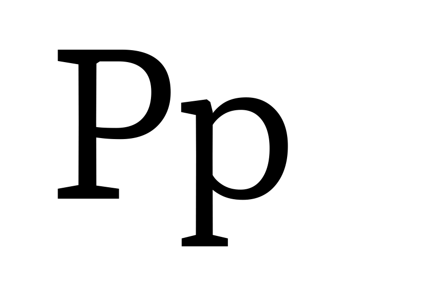

# Proposal Summary Form: Y Transparent Descender

This proposal summary describes a proposed X Transparent Decender axis as part of
a proposed system of parametric and optical axes.

## Adminstrative Information

See details in [Type Network Parametric Axes Proposal Overview](Overview.md).

## General Technical Information

**Overview:** This describes a proposed X Transparent Decender axis to vary the height of decenders.

**Related axes:** wght, width, opsz

**Similar axes:** [ytuc](ProposalSummary_.md), [ytlc](ProposalSummary_ytlc.md), [ytas](ProposalSummary_ytas.md).

**Axis type:** Parametric

## Proposed Axis Details

**Tag:** ytde

**Name:** Y Transparent Descender

**Description:** Assigns a “white” per-mille value to each instance of the design space.

**Valid numeric range:**  -1000 to 0

**Scale interpretation:** Values should be interpreted as per-mille-of-em.

**Recommended or required “Regular” value:** N/A

**Suggested programmatic interactions:** Example: Program or script may adjust the descenders
in coordination leading and column width to prevent letters from touching vertically.

**UI recommendations:** Users may choose to program a variant in connection to direct or
conjunctive input for a page description language, or via a user interface.

**Script or language considerations:** Can be used for all scripts.

**Additional information:** Y Transparent Descender changes the y, or vertical, descenders.
Contributes to optical size in making small sizes fit better in text settings. Useful in
adjusting letters when leading is reduced, in all sizes. Very useful in responsive design
when headlines change from single lines to multiple lines of text. The zone or general area
that descenders live in is an attribute that all users can easily point to (along with
collisions in this area suffered by fonts without it) but not an area they may know by name.
This name fits into the systematic structure of the overall system of proposed axes: Y
dimension transparency of descenders.

## Justification

See details in [Type Network Parametric Axes Proposal Overview](Overview.md).

## Other Supporting Information

The following image provides a visual demonstration:

