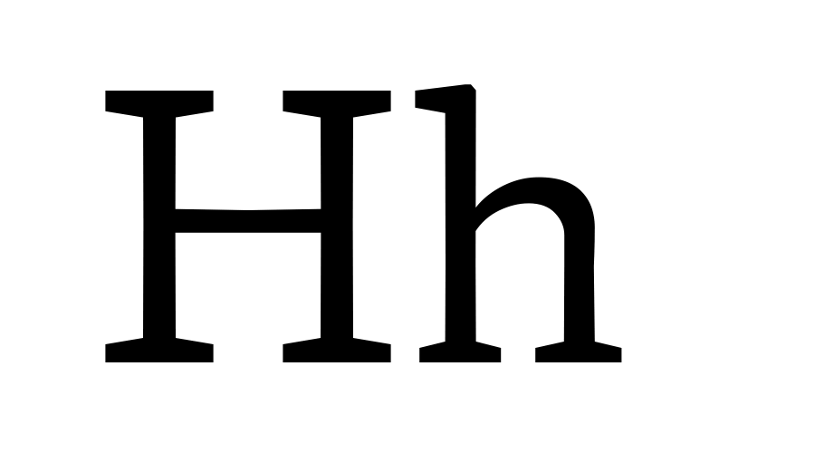

# Proposal Summary Form: Y Transparent Lowercase

This proposal summary describes a proposed X Transparent Lowercase axis as part
of a proposed system of parametric and optical axes.

## Adminstrative Information

See details in [Type Network Parametric Axes Proposal Overview](Overview.md).

## General Technical Information

**Overview:** This describes a proposed X Transparent Lowercase axis to vary the height
of lowercase letters (x-height).

**Related axes:**  wght, width, opsz

**Similar axes:** [ytuc](ProposalSummary_ytuc.md), [ytde](ProposalSummary_ytde.md), [ytas](ProposalSummary_ytas.md).

**Axis type:** Parametric

## Proposed Axis Details

**Tag:** ytlc

**Name:** Y Transparent Lowercase

**Description:** Assigns a “white” per-mille value to each instance of the design space.

**Valid numeric range:**  0 to 1000

**Scale interpretation:** Values should be interpreted as per-mille-of-em.

**Recommended or required “Regular” value:** N/A

**Suggested programmatic interactions:** Example: Program or script may adjust the uppercase
in coordination with another language or script, or adjust uppercase letters for a TV, VR,
video setting to adjust to space, resolution or orientation.  

**UI recommendations:** Users may choose to program a variant in connection to direct or
conjunctive input for a page description language, or via a user interface.

**Script or language considerations:** Can be used for all scripts.

**Additional information:** Y Transparent Lowercase changes lowercase letter white space in
the y, or vertical, direction. This axis contributes to optical size by raising the lowercase
to increase legibility in small sizes. By allowing this axes to be used independently of
optical size, the axis contributes to expanding the design space of a typeface. The "x height"
of lowercase Latin letters is an attribute that many users can point to, but rather than
calling this axis "x height," we see conventionality benefits in a name that fits into the
systematic structure of the overall system of proposed axes: Y dimension transparency of
lowercase letters.

ytlc is measured from the baseline to the top x-height

## Justification

See details in [Type Network Parametric Axes Proposal Overview](Overview.md).

## Other Supporting Information

The following image provides a visual demonstration:

