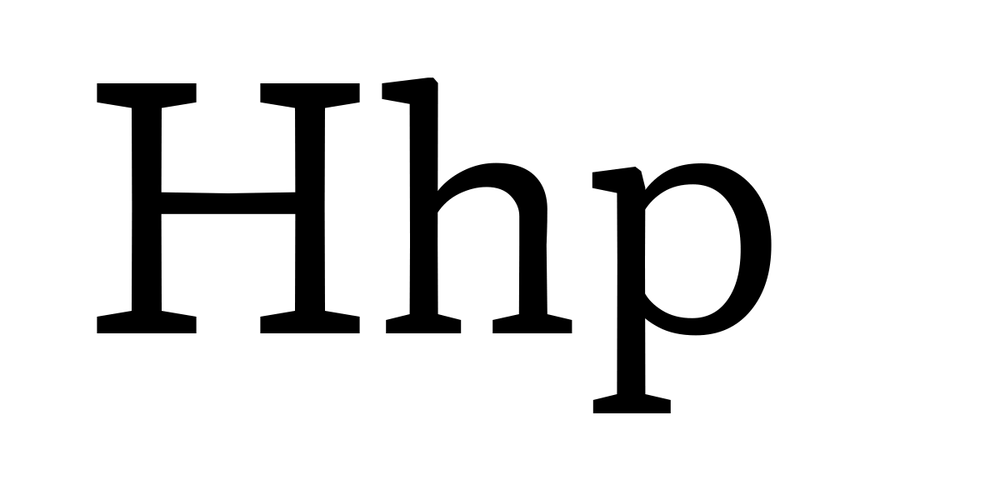

## Proposed Axis Details

**Tag:** ytra

**Name:** Y Transparent

**Axis type:** Parametric

**Description:** assigns an overall “white” per mille value to each instance

**Valid numeric range:**  0 to 2000

**Scale interpretation:** Values should be interpreted as per-mille-of-em

**Recommended or required “Regular” value:** N/A

**Suggested programmatic interactions:** Example: Program or script may choose to adjust YTRA in order to change the height of glyphs to emphasize text or headline, fit text to a space, stack and justify text.

**UI recommendations:** Users may choose to program a variant in connection to direct or conjunctive input for a page description language, or via a user interface

**Script or language considerations:** Can be used for all scripts

**Related axes:** yopq 

**Similar axes:** xtra, xopq, ytra

**Additional information:** `ytra` changes the white space in the y or vertical direction. Combined with other axes it contributes to opsz, potentially HGHT among many options. 

