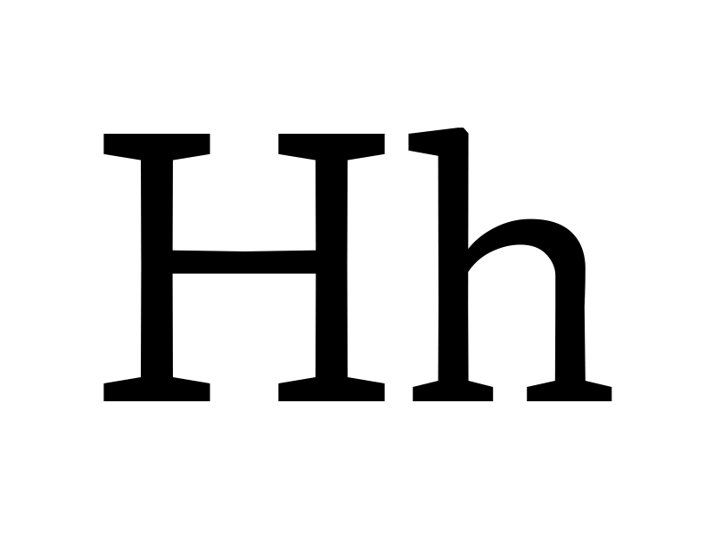

# Proposal Summary Form: Y Transparent Uppercase

This proposal summary describes a proposed X Transparent Lowercase axis as part of
a proposed system of parametric and optical axes.

## Adminstrative Information

See details in [Type Network Parametric Axes Proposal Overview](Overview.md).

## General Technical Information

**Overview:** This describes a proposed X Transparent Uppercase axis to vary the
height of uppercase letters (cap-height).

**Related axes:** wght, width, opsz

**Similar axes:** [ytlc](ProposalSummary_ytlc.md), [ytde](ProposalSummary_ytde.md), [ytas](ProposalSummary_ytas.md).

**Axis type:** Parametric

## Proposed Axis Details

**Tag:** ytuc

**Name:** Y Transparent Uppercase

**Description:** a “white” per-mille value for each Uppercase Height in the design space.

**Valid numeric range:**  -1000 to 1000

**Scale interpretation:** Values should be interpreted as per-mille-of-em.

**Recommended or required “Regular” value:** N/A

**Suggested programmatic interactions:** Example: Program or script may adjust the uppercase
in coordination with another language or script, or adjust uppercase letters in a TV, VR, video
setting to adjust to space, resolution or orientation.  

**UI recommendations:** Users may choose to program a variant in connection to direct or
conjunctive input for a page description language, or via a user interface.

**Script or language considerations:** Can be used for all scripts.

**Additional information:** Y Transparent Uppercase changes the y, or vertical, direction size of
white space in uppercase letters. By itself, contributes to the design space when building of
small, medium and tall capitals, or unicase. The height of the upper case Latin letters is an
attribute that all users can easily point to, but rather than calling this axes "cap height,"
we see conventionality benefits in a name that fits into the systematic structure of the overall
system of proposed axes: Y dimension transparency of upper case letters.

ytuc is measured from the baseline to the top of Uppercase

## Justification

See details in [Type Network Parametric Axes Proposal Overview](Overview.md).

## Other Supporting Information

The following image provides a visual demonstration:

